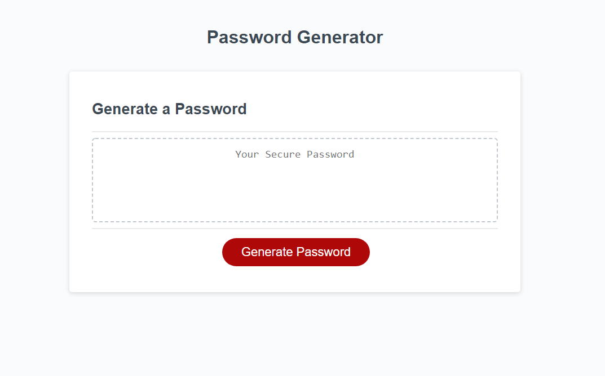

# A Very Sassy Password Generator

## Description

This is a web page with  JavaScript elements that provides prompts to help generate a randomized password between the lengths of 8 and 128 characters.

## Installation

N/A

## Usage

### How to Use:
* click on "Generate Password"
* input a length between 8 to 128 when prompted for the length of the password
* choose the criterias you'd like to include
* enjoy and have fun memorizing your new, randomly generated password
  

## Credits

Me, myself, and Google Chrome.

## License

Please refer to the LICENSE in the repo.

## Badges

